# beta-code

A competitive coding platform where players solve programming problems against the clock, get instant feedback from an automated test runner, and climb a live leaderboard.

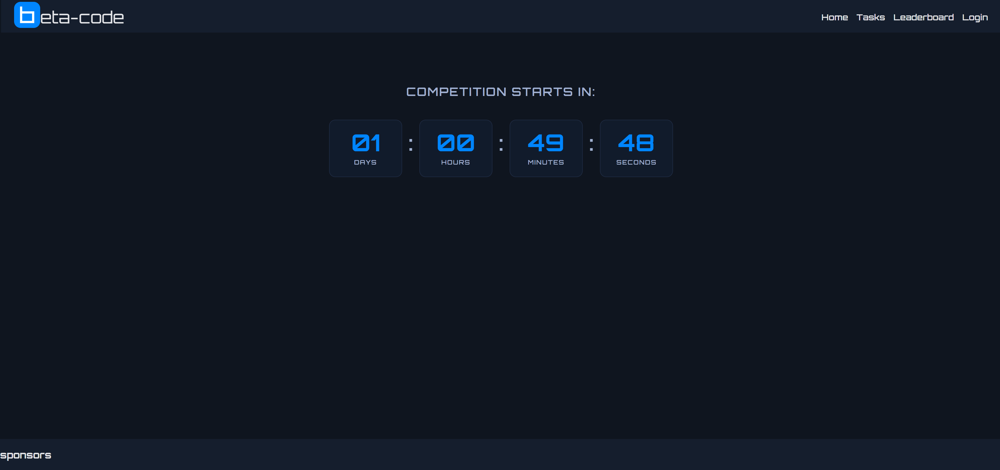

## Table of Contents

- [Overview](#overview)
- [How It Works](#how-it-works)
  - [1. Sign Up / Login](#1-sign-up--login)
  - [2. Wait for the Competition to Start](#2-wait-for-the-competition-to-start)
  - [3. Browse Tasks](#3-browse-tasks)
  - [4. Solve a Task](#4-solve-a-task)
  - [5. Track Your Progress](#5-track-your-progress)
  - [6. Leaderboard](#6-leaderboard)
  - [7. Admin Panel](#7-admin-panel)
- [Getting Started](#getting-started)

## Overview

beta-code runs timed coding competitions. An admin configures a start and end time, creates tasks with hidden test cases, and players race to solve as many as possible for points. Submissions are compiled and run against test cases automatically, with results (accepted, wrong answer, or compile error) shown immediately.

## How It Works

### 1. Sign Up / Login

New players create an account, existing players log in. Both forms are on the same card, toggled by tab.

| Login | Sign Up |
|---|---|
| 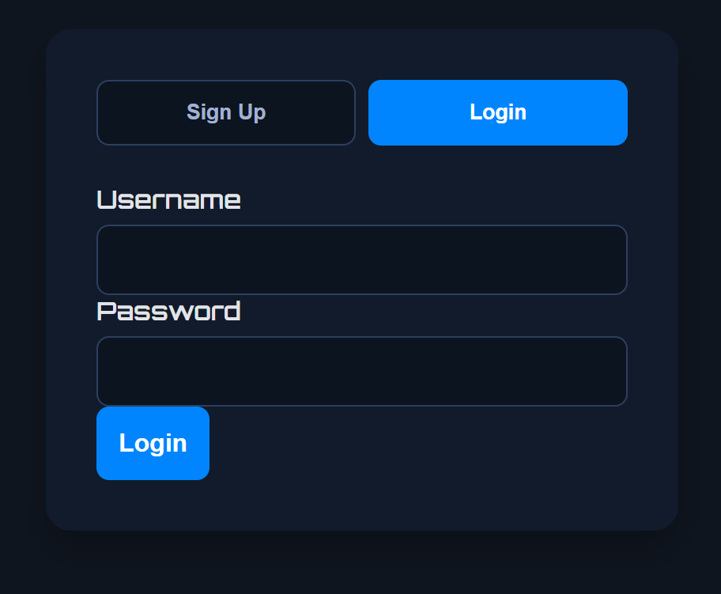 | 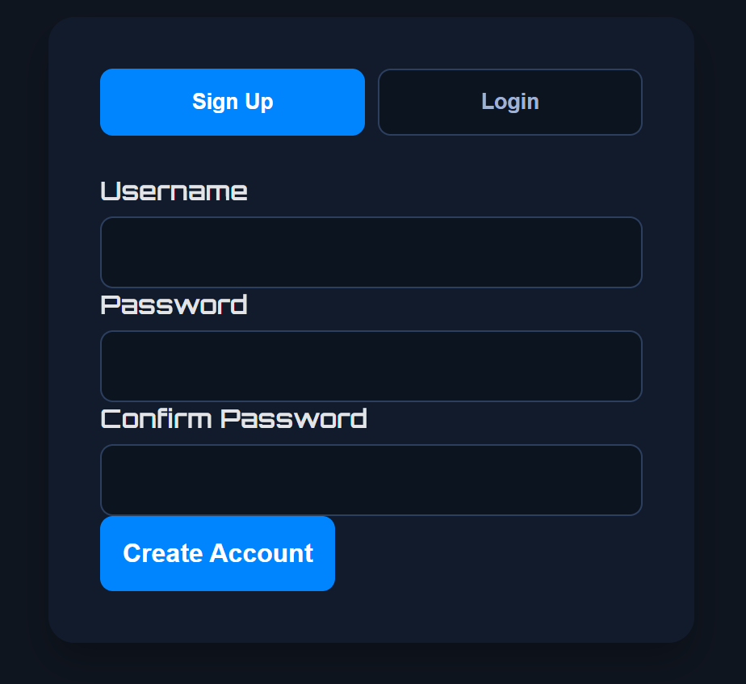 |

Once logged in, the navbar shows the current username and a logout option.

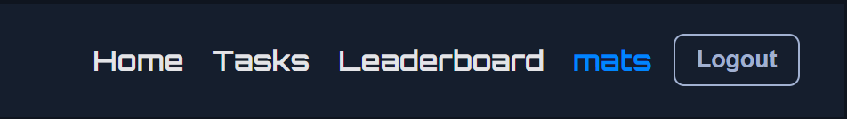

### 2. Wait for the Competition to Start

The homepage shows a live countdown to the competition's configured start time. Once the countdown hits zero, the page updates automatically and a **Go to Tasks** button appears.

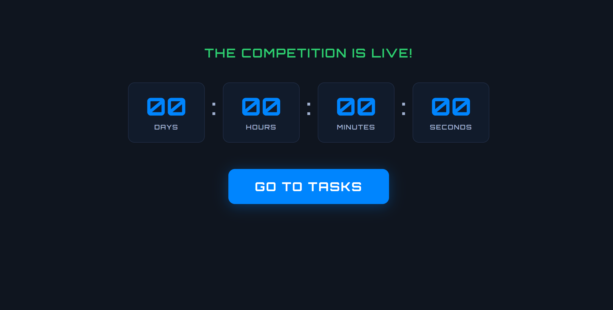

### 3. Browse Tasks

Once the competition is live, players see the full task list with difficulty and point values, along with a running count of how many they've completed.

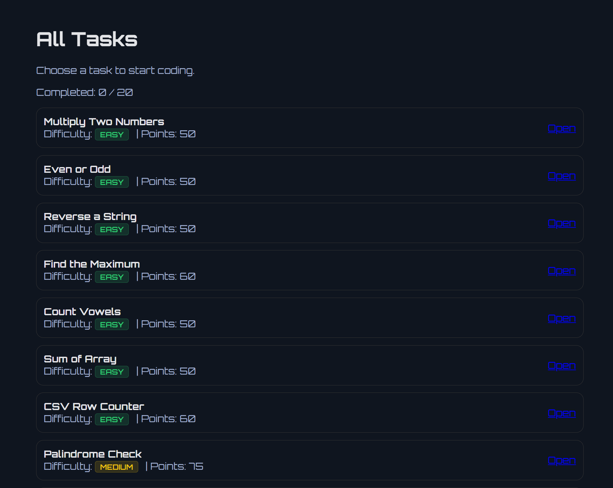

### 4. Solve a Task

Each task has a description, starter code in an in-browser editor, and a **Run** button that compiles and executes the code against the task's test cases.

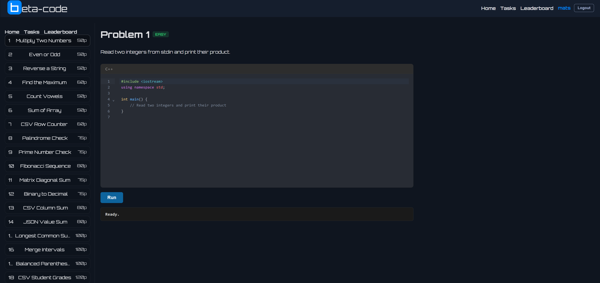

Results are shown right below the editor:

- **Wrong Answer** — shows the input, expected output, and actual output for every visible (non-hidden) test, plus a pass/fail summary line for the hidden grading test (its contents stay secret, only the verdict is shown).

  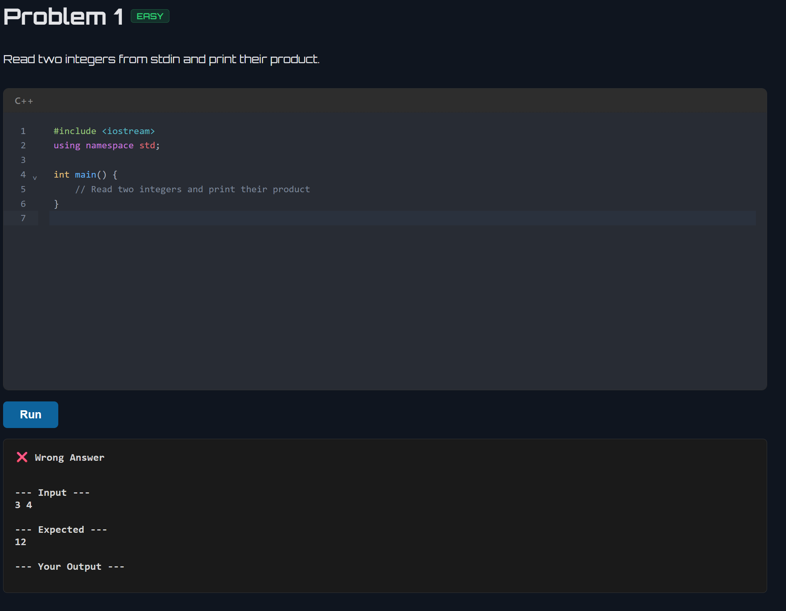

- **Compile Error** — shows the raw compiler output so players can debug.

  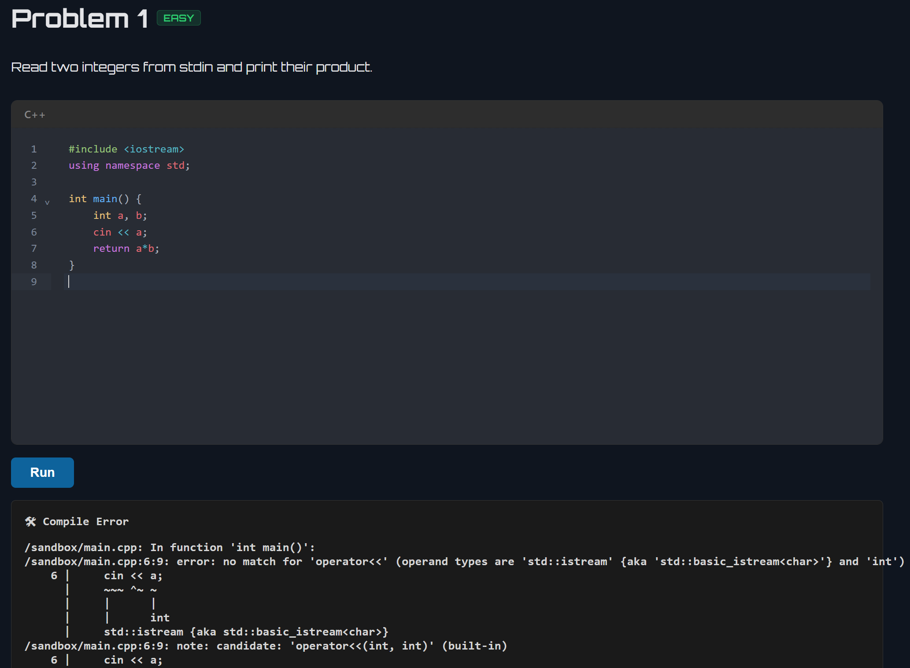

- **Accepted** — the task is marked complete and points are awarded.

  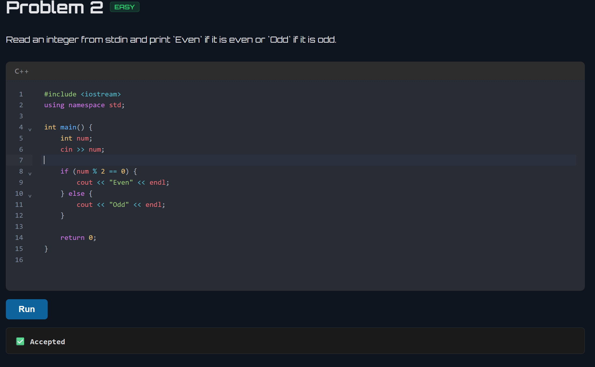

### 5. Track Your Progress

Completed tasks are highlighted in the task list with a checkmark, so players can see at a glance what's left.

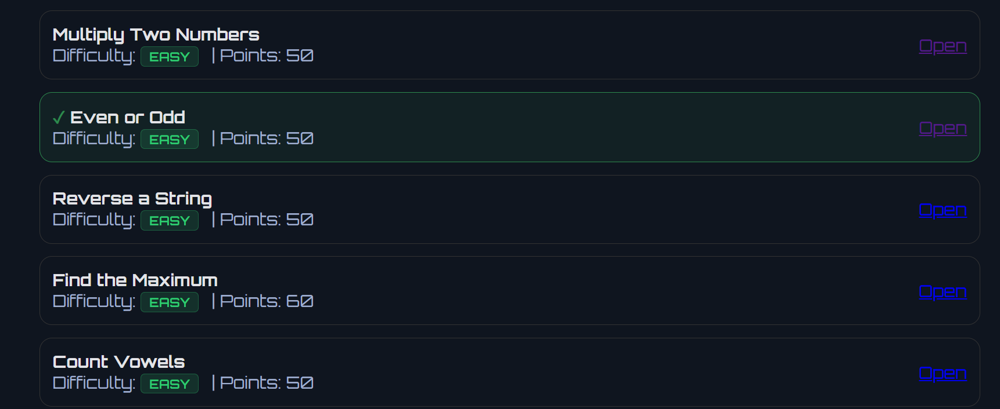

### 6. Leaderboard

The leaderboard shows a countdown to the competition's end time, a live score-progress chart per player, and a ranked table of players by points and tasks completed. (Work in progress)

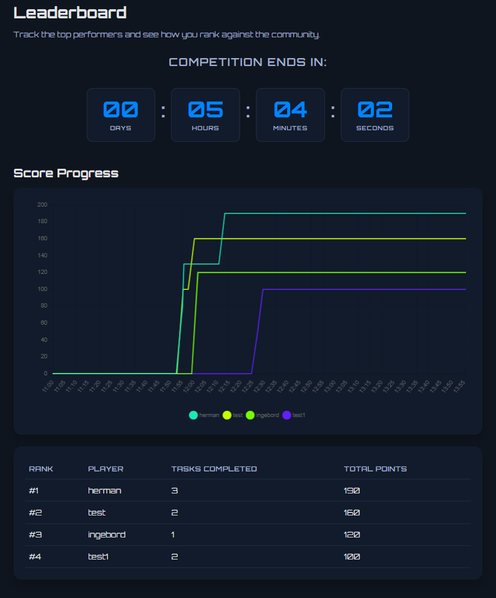

### 7. Admin Panel

Admins get a separate panel with four tabs for managing the competition.

**Players** — view all registered players, their points and completed tasks, manually assign tasks, and delete accounts.

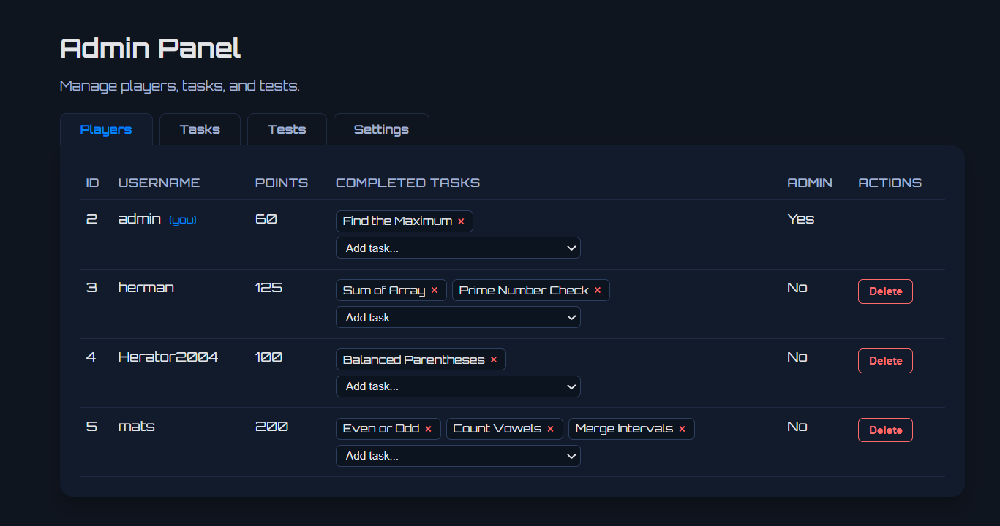

**Tasks** — create new tasks with a name, description, starter code, point value, type, and difficulty, and manage existing ones.

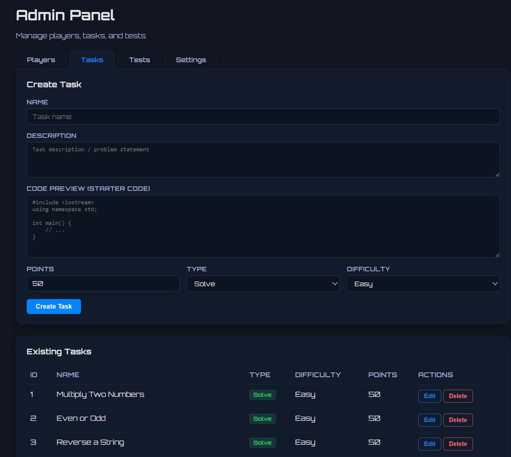

**Tests** — attach sample or hidden test cases (stdin input + expected output) to any task, optionally with a supporting data file.

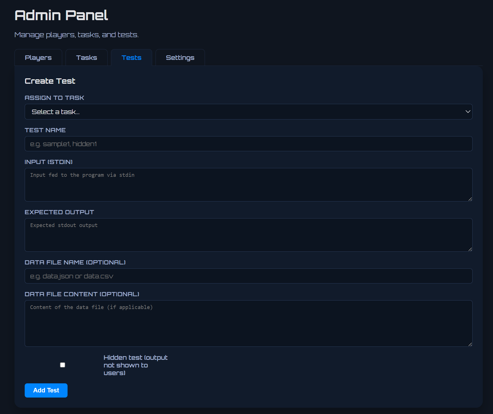

Existing tests for a task can be reviewed and edited from the same tab:

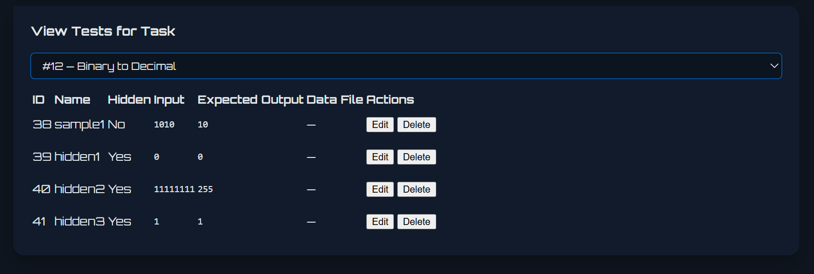

**Settings** — set the competition's start and end time (the leaderboard freezes 15 minutes before the end), or start the competition immediately.

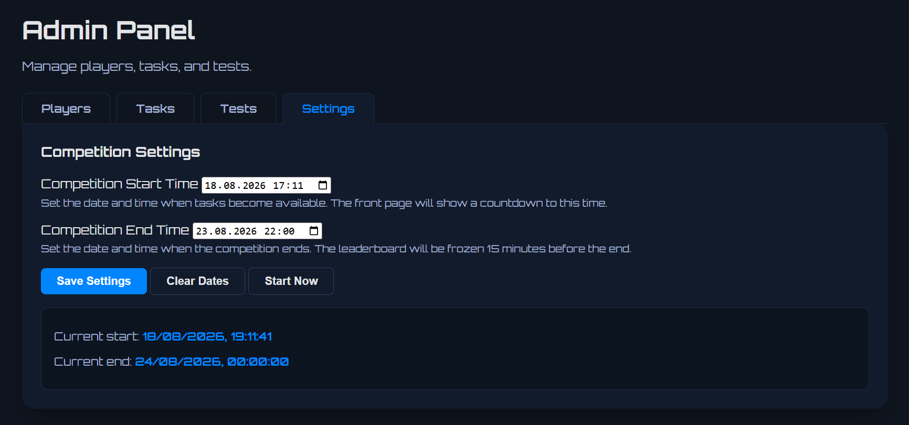

## Getting Started

### Prerequisites
 
- Docker installed and running
- Node.js and npm installed
- Redis (via Docker)
### Install
 
Run this in root to get all the packages:
 
```bash
npm run install:all
```

### Configure Environment Variables

`.env` files hold local secrets and aren't committed to git. Copy the template and fill it in (a `RUNNER_SECRET` is required — the frontend refuses to serve test data without one):

```bash
cp frontend/.env.example frontend/.env
```

Generate a `RUNNER_SECRET` value with:

```bash
node -e "console.log(require('crypto').randomBytes(32).toString('hex'))"
```

Paste it into `frontend/.env`, and use the same value in the `RUNNER_SECRET=` env var in the root `package.json` `start`/`build` scripts (the runner process reads it from there, not from a `.env` file).

### Launch the Services
 
Run this in root:
 
```bash
npm start
```
 
### Stopping the Services
 
To stop the services, press `Ctrl+C` in the terminal window, then run:
 
```bash
npm run stop
```
 
### Admin Panel
 
| Username | Password |
|---|---|
| `admin` | `admin123` |
 